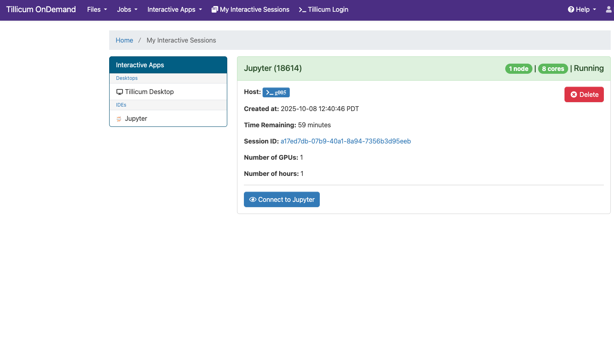

# Jupyter on Open OnDemand

Tillicum provides JupyterLab and Jupyter Notebook access through [**<ins>Open OnDemand (OOD)</ins>**](https://tillicum-ood.hyak.uw.edu/).

> 📝 **NOTE:** [**<ins>UW VPN</ins>**](./01-vpn.md) is required to access OOD if you are off-campus.

This interface allows you to run interactive Jupyter sessions launched from the `$Home` directory on compute nodes without manually submitting Slurm jobs.

## Open OnDemand

Open OnDemand is a web-based portal that provides an integrated, single access point for remote HPC Cluster.

It enables you to perform many common tasks without CLI, including:
- Managing files (upload, download, edit)
- Monitoring running jobs and resource usage
- Launching interactive jobs (e.g., Jupyter, RStudio, VS Code)
- Displaying remote desktop for software graphical interface (e.g., MATLAB, COMSOL)

## Launch JupyterLab or Jupyter Notebook

You can run JupyterLab (recommended) or the classic Jupyter Notebook interface through OOD's Interactive Apps menu.

**Step 1: Log in to Open OnDemand**

Log in to [**<ins>Tillicum OOD</ins>**](https://tillicum-ood.hyak.uw.edu/) using your UW NetID and Duo.

**Step 2: Navigate to the Jupyter App**

From the OOD dashboard top menu, select **Interactive Apps** > **Jupyter**. 

The default interface is JupyterLab.
If you prefer the classic interface, choose “Jupyter Notebook” instead.

**Step 3: Configure the Interactive Job**

You will be prompted to configure the resources for your Jupyter session.

For this class, configure the form as follows:
- **Account**: imt526a
- **QoS**: debug
- **Number of GPUs**: 1
- **Number of hours**: 1
- **User Interface**: Jupyter Lab (recommended). If you prefer the classic interface, select “Jupyter Notebook” instead.

Finally, click the **Launch** button.

**Step 4: Wait for Job Allocation**

After submission, OOD will:

1. Submit a Slurm interactive job under your account.
2. Wait for resources to become available.
3. When ready, show a **Connect to Jupyter**button.

The session page will display:
- Slurm Job ID — the scheduler identifier (the number in the parentheses).
- Host — the compute node running your job.
- Status — changes to Running when ready.
- Session ID — links to detailed logs for troubleshooting.

Click **Connect to Jupyter** once the job is running. A new browser tab will open with your live Jupyter environment running on a Tillicum compute node.


*Screenshot showing your OOD job queue. The job will be ready when the status changes to "Running" and the button to "Connect to Jupyter" is visible.*

## Use Conda Environments as Python Kernels (Optional)

By default, Jupyter uses the system's Python kernel provided by a minimal Python environment. There are also several prebuilt Python kernels with more packages installed.

You can also use your own Conda environments as custom Python kernels.

**Step 1: Load Conda and Activate Your Environment**

If you already have a conda environment you want to use as a Jupyter kernel, **make sure it includes the IPython kernel package `ipykernel`**. Otherwise, create a new Conda environment with the packages you want plus `ipykernel`.

From a terminal (either SSH or OOD's "Tillicum Login"), run:

```bash
module load conda
conda activate myenv
conda install ipykernel
```

**Step 2: Register Your Environment as a Kernel**

Run `ipykernel install` in your activated environment to set up a Jupyter [**<ins>kernelspec</ins>**](https://jupyter-client.readthedocs.io/en/latest/kernels.html).

```bash
python -m ipykernel install --user --name myenv --display-name "Python (myenv)"
```

This creates a Jupyter kernel entry visible in Jupyter notebook. Any packages installed in your Conda environment will automatically be available to you. Command breakdown:

- `--name`: internal environment name
- `--display-name`: name shown in JupyterLab

> 💡 **TIP:** Containers can also be registered as Jupyter kernels.

You can list installed kernels with:

```
jupyter kernelspec list
```

**Step 3: Launch A Jupyter Notebook**

In the **Launcher** tab of your Jupyter session, select your custom kernel under the **Notebook** section.

Your notebook will now run inside your custom Conda environment.

**Step 4: Switch the Kernel**

Inside a notebook, from the JupyterLab top menu select **Kernel** > **Change Kernel** to switch kernels in the dropdown box.

> 💡 **TIP:** If your new kernel doesn't appear, restart your Jupyter session after running the `ipykernel install` command.

## Close the Session

When you finish:

1. Save your work and close the Jupyter browser tab.
2. Return to OOD **My Interactive Sessions** dashboard and click **Delete** on your running session card.

The compute resources will be released back to the cluster.

> ⚠️ **WARNING:** Leaving sessions running consumes GPU hours and counts toward your project usage.