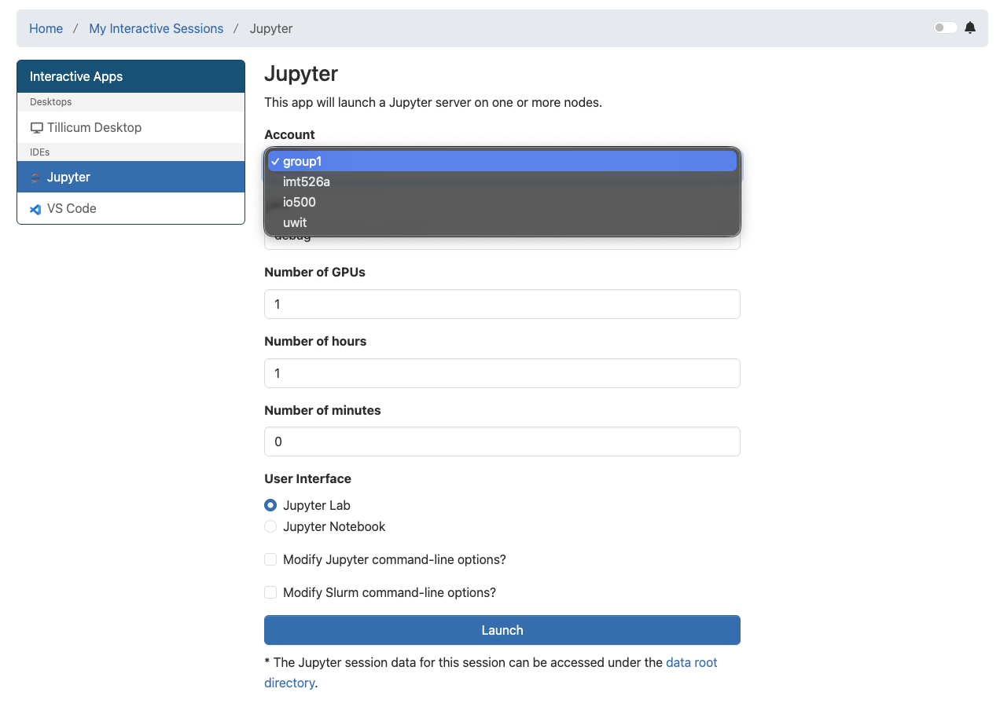

# Group Projects on Tillicum

As you move into the group project phase of the course, you may begin using **Slurm** to run longer and more complex workloads on Tillicum. This page outlines what you need to know to get started.

---

### Group Slurm Accounts

Each project group has been assigned its own Slurm account:

```bash
group1, group2, group3, ...
```
> This includes using your Jupyter Notebooks for group work, select your group under the "Account" field when launching your Jupyter job. 

When submitting jobs, you must use **your group’s account**, for example:

```bash
#SBATCH --account=group1
```

Also, please use the group account when launching Jupyter Notebooks via Open OnDemand for group project work. 


*Screenshot showing your Jupyter Form Requestand options to select the group project account from the dropdown menu.*


The course instructor has requested that all group project work use these group-specific accounts (instead of the general course account).

This helps:
* Track compute usage per project
* Understand the cost of different workloads
* Improve planning for future courses

---
### Storage and File Management

Before running jobs, please review:

👉 [**<ins>03-filesystem.md</ins>**](./03-filesystem.md)

Key reminders
* Use your group directory:
```bash
/gpfs/projects/imt526a/groupX
```
* Store all inputs/outputs there
* Avoid using home directories for project data
